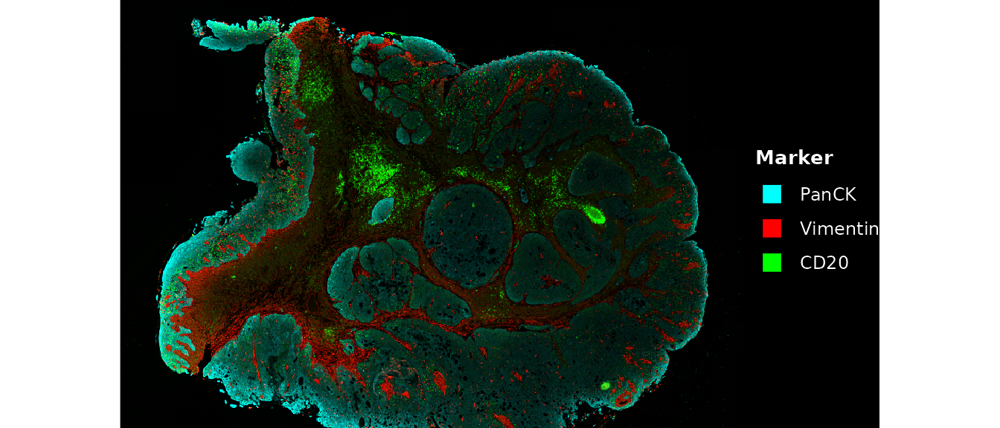
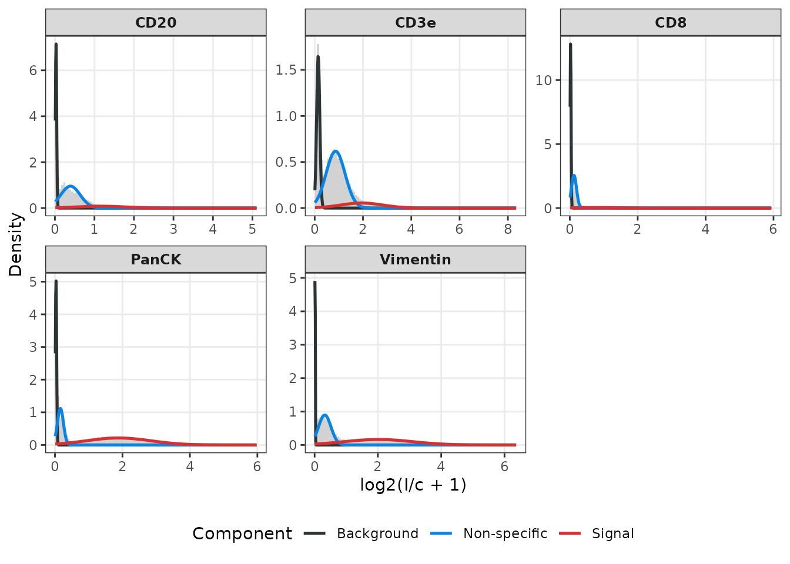
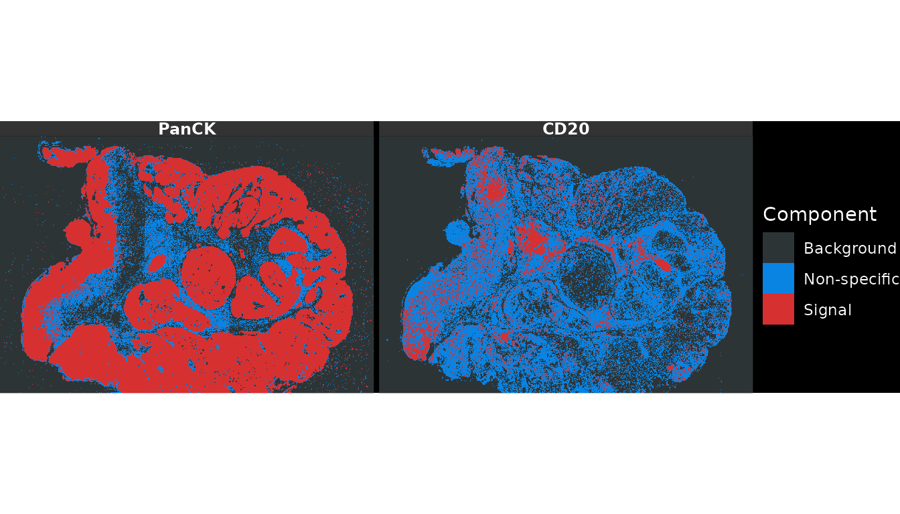
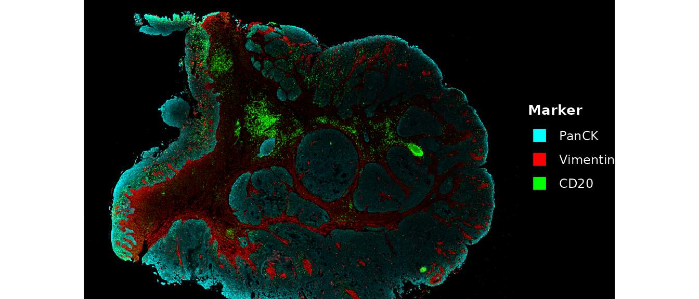
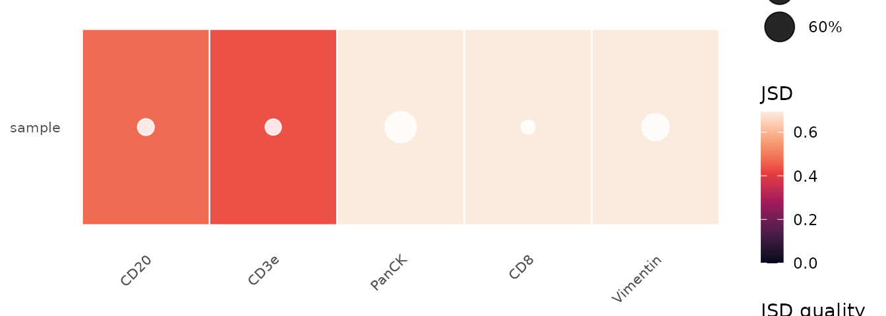
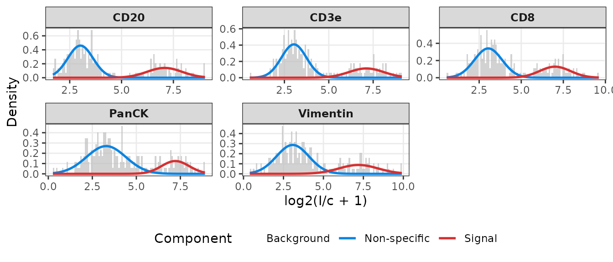
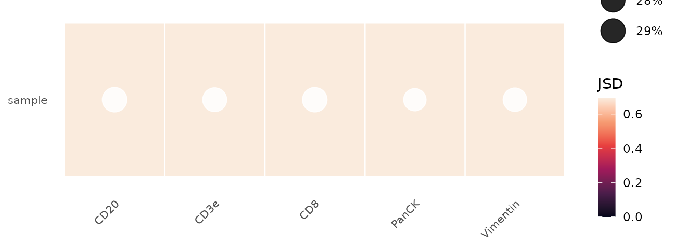

# Getting started with bgnormR

## Introduction

**bgnorm** (Kharbanda, Tubelleza *et al.* 2025) is a generative
statistical framework for background correction, normalisation, and
quality control of multiplex spatial proteomics data, including data
from the Akoya PhenoCycler-Fusion (formerly CODEX), Cell DIVE, IMC, and
CosMx platforms.

The framework models log₂-transformed fluorescence intensities as a
**three-component Gaussian Mixture Model** (GMM):

| Component | Biological interpretation                  |
|-----------|--------------------------------------------|
| 1         | Background (empty space, instrument noise) |
| 2         | Non-specific binding / autofluorescence    |
| 3         | True biological signal                     |


Three-component signal model: each pixel intensity X is the sum of
independent latent sources U1 (background), U2 (non-specific), and U3
(signal).

A closed-form **deconvolution** step isolates the signal component from
background sources. An optional **quantile normalisation** step
(bgnormQ) unifies the dynamic range across markers, samples, and 3-D
tissue slices, enabling a single fixed positivity threshold across the
dataset.

The **Jensen-Shannon Divergence (JSD)** between components 2 and 3
provides an automated quality control metric: higher JSD indicates
better staining quality.

### Installation

``` r

if (!requireNamespace("BiocManager", quietly = TRUE))
    install.packages("BiocManager")
BiocManager::install("bgnormR")
```

``` r

library(bgnormR)
```

------------------------------------------------------------------------

## Example dataset

The package includes a cropped head-and-neck cancer (HNC) tissue section
imaged on an Akoya PhenoCycler-Fusion platform. The file ships at
`inst/extdata/PA_HNC_sample.qptiff` and contains five markers across a
550 × 800 pixel region.

``` r

path <- system.file("extdata", "PA_HNC_sample.qptiff", package = "bgnormR")
img  <- read_qptiff(path)
img
#> QPTIFFImage
#>   Dimensions: 550 x 800 (H x W)
#>   Channels  : 5 
#>   Names     : CD20, CD3e, CD8, PanCK, Vimentin  
#>   Format    : unknown 
#>   Levels    : 1
```

[`read_qptiff()`](../reference/read_qptiff.md) parses the channel names
from the embedded metadata, so `names(img)` returns the protein names
directly:

``` r

names(img)   # five-plex panel
#> [1] "CD20"     "CD3e"     "CD8"      "PanCK"    "Vimentin"
dim(img)     # height × width × channels
#> [1] 550 800   5
```

------------------------------------------------------------------------

## Pixel-level normalisation

### Raw intensity maps

Before normalisation, visualise the raw 16-bit intensities to confirm
the image loaded correctly.
[`plot_qptiff()`](../reference/plot_qptiff.md) renders one panel per
requested channel.

``` r

plot_qptiff(img, markers = c("PanCK", "Vimentin", "CD20"))
```



### Running bgnorm_pixels

[`bgnorm_pixels()`](../reference/bgnorm_pixels.md) fits a
three-component GMM to each channel independently. `sample_prop`
controls the fraction of non-zero pixels used for fitting — the default
0.1 (10 %) is sufficient for full-resolution Akoya images while keeping
runtime short.

``` r

res <- bgnorm_pixels(img, sample_prop = 0.1)
res
#> QPTIFFImage
#>   Dimensions: 550 x 800 (H x W)
#>   Channels  : 5 
#>   Names     : CD20, CD3e, CD8, PanCK, Vimentin  
#>   Format    : unknown 
#>   Levels    : 1 
#>   bgnorm    : yes (5 channel(s))
```

`res` is a `QPTIFFImage` whose pixel values are the background-adjusted
log₂-intensities. Per-channel model parameters are stored as an
attribute and retrieved with
[`bgnorm_results()`](../reference/bgnorm_results.md):

``` r

br_panck <- bgnorm_results(res)[["PanCK"]]
print(br_panck)
#> BgnormResult (pixel-level)
#>   n = 440000 
#>   Component means: 0.03 0.161 1.884 
#>   JSD (QC metric): 0.8811 
#>   BIC (G=2): -1.67   BIC (G=3): -1.38 
#>   No signal detected: FALSE 
#>   Quantile normalised: FALSE 
#>   Tissue positivity: 67%
```

[`summary()`](https://rdrr.io/r/base/summary.html) shows the full
component table:

``` r

summary(br_panck)
#> BgnormResult summary (pixel-level)
#>   JSD: 0.8811 
#>   Quantile normalised: FALSE 
#> 
#>     component   mean     sd proportion
#>    Background 0.0299 0.0186     0.2378
#>  Non-specific 0.1606 0.0897     0.2512
#>        Signal 1.8837 0.9511     0.5110
```

### Intensity distributions with GMM overlay

[`plot_distributions()`](../reference/plot_distributions.md) draws the
raw log₂-intensity histogram alongside the fitted GMM component
densities.

``` r

plot_distributions(res)
```



The three overlaid curves correspond to the background (blue),
non-specific (orange), and signal (red) components. Markers with
well-separated signal components (PanCK, Vimentin) show a clearly
distinct red peak at high intensity.

### Background class assignment

[`plot_pixel_classes()`](../reference/plot_pixel_classes.md) colours
each pixel by its MAP component assignment (background / non-specific /
signal).

``` r

plot_pixel_classes(res, markers = c("PanCK", "CD20"))
```



### Adjusted intensity maps

After normalisation, visualise the background-adjusted images. The
adjusted values are stored inside `res` (the returned `QPTIFFImage`), so
`plot_qptiff(res)` displays them directly — applying the `2^x`
back-transform so the display is in linear intensity units.

``` r

plot_qptiff(res, markers = c("PanCK", "Vimentin", "CD20"), scale = "marker")
```



### Quantile normalisation (bgnormQ)

Setting `quantile_norm = TRUE` rescales adjusted intensities so that the
75th percentile of the fitted signal component equals 1 across all
markers. This enables a single positivity threshold to be applied
consistently across markers, samples, and tissue sections.

``` r

res_q <- bgnorm_pixels(img, sample_prop = 0.1, quantile_norm = TRUE)
```

------------------------------------------------------------------------

## Quality control

### JSD summary table

[`qc_summary()`](../reference/qc_summary.md) computes the JSD between
the non-specific and signal components for every marker in a single
call.

``` r

qc_df <- qc_summary(res)
qc_df
#>       name       jsd prop_signal
#> 1     CD20 0.4721159  0.12582686
#> 2     CD3e 0.4379568  0.11888275
#> 3      CD8 0.7073366  0.06469394
#> 4    PanCK 0.8811337  0.51098633
#> 5 Vimentin 0.7507301  0.44383123
```

JSD values below 0.1 indicate likely failed staining; values between 0.1
and 0.2 warrant manual inspection (Kharbanda *et al.* 2025).

### JSD heatmap

[`plot_jsd_heatmap()`](../reference/plot_jsd_heatmap.md) summarises the
JSD per marker as a heatmap, with circles indicating data quality (white
≥ 0.2, orange 0.1–0.2, red \< 0.1). Pass a named list of `QPTIFFImage`s
to compare multiple samples side-by-side.

``` r

plot_jsd_heatmap(res)
```



------------------------------------------------------------------------

## Exporting normalised images

[`write_qptiff()`](../reference/write_qptiff.md) saves a `QPTIFFImage`
as a multi-page 16-bit TIFF, one page per channel. For bgnorm-adjusted
images the pixel values are back-transformed to a linear scale (`2^x`)
before writing. Channel names and bgnorm model parameters are embedded
in each page’s `ImageDescription` tag so the file remains
self-documenting.

``` r

out <- file.path(tempdir(), "PA_HNC_bgnorm.tif")
write_qptiff(res, out)

# Read back – channel names are preserved
img_out <- read_qptiff(out)
names(img_out)
#> [1] "CD20"     "CD3e"     "CD8"      "PanCK"    "Vimentin"
dim(img_out)
#> [1] 550 800   5
```

------------------------------------------------------------------------

## Cell-level normalisation

When only per-cell intensity summaries (mean or median intensity per
cell) are available, use
[`bgnorm_cells()`](../reference/bgnorm_cells.md), which applies a
two-component GMM (non-specific / signal) rather than the full
three-component pixel model.

### Single-marker: bgnorm_cells

``` r

set.seed(3)
cell_intensities <- inv_log_transform(
    c(rnorm(300, mean = 3, sd = 0.5),
      rnorm(100, mean = 7, sd = 0.9)),
    cofactor = 150
)
res_cell <- bgnorm_cells(cell_intensities)
print(res_cell)
#> BgnormResult (cell-level)
#>   n = 400 
#>   Component means: 3.022 6.965 
#>   JSD (QC metric): 0.986 
#>   No signal detected: FALSE 
#>   Quantile normalised: FALSE 
#>   Tissue positivity: 25.1%
```

### Integration with SummarizedExperiment

[`bgnorm_sce()`](../reference/bgnorm_sce.md) processes a
`SummarizedExperiment` (or any subclass such as `SingleCellExperiment`
or `SpatialExperiment`): it reads the requested assay, runs
[`bgnorm_cells()`](../reference/bgnorm_cells.md) independently for each
marker, and stores the adjusted intensities in a new assay alongside
per-marker `BgnormResult` objects in
[`metadata()`](../reference/metadata.md).

``` r

library(SummarizedExperiment)
set.seed(5)

n_cells   <- 200L
n_markers <- 5L
marker_names <- c("CD20", "CD3e", "CD8", "PanCK", "Vimentin")

make_cell_raw <- function(j) {
    inv_log_transform(
        c(rnorm(round(n_cells * 0.7), 3, 0.5 + 0.1 * j),
          rnorm(round(n_cells * 0.3), 7, 0.8 + 0.1 * j)),
        cofactor = 150
    )
}
raw_mat <- do.call(rbind, lapply(seq_len(n_markers), make_cell_raw))
rownames(raw_mat) <- marker_names
colnames(raw_mat) <- paste0("cell", seq_len(n_cells))

se <- SummarizedExperiment(assays = list(counts = raw_mat))
se <- bgnorm_sce(se, assay.type = "counts", name = "bgnorm")
assayNames(se)
#> [1] "counts" "bgnorm"
```

Per-marker model parameters are accessible via
[`metadata()`](../reference/metadata.md):

``` r

bgnorm_meta <- S4Vectors::metadata(se)$bgnorm_results
cat("JSD for CD20:", round(bgnorm_meta$CD20$jsd, 3), "\n")
#> JSD for CD20: 0.989
```

### Distributions and QC for cell-level data

[`plot_distributions()`](../reference/plot_distributions.md) and
[`plot_jsd_heatmap()`](../reference/plot_jsd_heatmap.md) both accept a
`SummarizedExperiment` with bgnorm results stored in
[`metadata()`](../reference/metadata.md).

``` r

plot_distributions(se)
```



``` r

plot_jsd_heatmap(se)
```



``` r

qc_summary(bgnorm_meta)
#>       name       jsd prop_signal
#> 1     CD20 0.9892432   0.2964197
#> 2     CD3e 0.9684877   0.2811681
#> 3      CD8 0.9548634   0.2952482
#> 4    PanCK 0.9244953   0.2446019
#> 5 Vimentin 0.8745865   0.2712931
```

------------------------------------------------------------------------

## Mathematical background

### Log₂ transform

``` math
I_{\log} = \log_2\!\left(\frac{I}{c} + 1\right), \quad c = 150
```

### Three-component GMM

``` math
f(X_i) = \sum_{j=1}^{3} \pi_j \, \mathcal{N}(X_i \mid \mu_j, \sigma_j^2)
```

Components are ordered so that $`\mu_1 < \mu_2 < \mu_3`$ (background,
non-specific, signal).

### Background deconvolution

``` math
X_{\text{adj}}(x) = P(C\!=\!3 \mid x) \left[
  (\mu_3 - \mu_2) +
  \frac{\sigma_3^2 + \sigma_2^2 - 2\min(\sigma_2^2, \sigma_3^2)}{\sigma_3^2}
  (x - \mu_3)
\right]
```

### Quantile normalisation factor

``` math
q_{\text{norm}} = P(C\!=\!3 \mid q_{0.75}) \left[
  (\mu_3 - \mu_2) +
  \frac{\sigma_3^2 + \sigma_2^2 - 2\min(\sigma_2^2,\sigma_3^2)}{\sigma_3^2}
  (q_{0.75} - \mu_3)
\right]
```

### Jensen-Shannon Divergence

``` math
\text{JSD}(P \| Q) = \frac{1}{2} D_{\text{KL}}(P \| M) +
                        \frac{1}{2} D_{\text{KL}}(Q \| M), \quad
M = \frac{P + Q}{2}
```

------------------------------------------------------------------------

## Session information

``` r

sessionInfo()
#> R version 4.6.1 (2026-06-24)
#> Platform: x86_64-pc-linux-gnu
#> Running under: Ubuntu 24.04.4 LTS
#> 
#> Matrix products: default
#> BLAS:   /usr/lib/x86_64-linux-gnu/openblas-pthread/libblas.so.3 
#> LAPACK: /usr/lib/x86_64-linux-gnu/openblas-pthread/libopenblasp-r0.3.26.so;  LAPACK version 3.12.0
#> 
#> locale:
#>  [1] LC_CTYPE=C.UTF-8       LC_NUMERIC=C           LC_TIME=C.UTF-8       
#>  [4] LC_COLLATE=C.UTF-8     LC_MONETARY=C.UTF-8    LC_MESSAGES=C.UTF-8   
#>  [7] LC_PAPER=C.UTF-8       LC_NAME=C              LC_ADDRESS=C          
#> [10] LC_TELEPHONE=C         LC_MEASUREMENT=C.UTF-8 LC_IDENTIFICATION=C   
#> 
#> time zone: UTC
#> tzcode source: system (glibc)
#> 
#> attached base packages:
#> [1] stats4    stats     graphics  grDevices utils     datasets  methods  
#> [8] base     
#> 
#> other attached packages:
#>  [1] SummarizedExperiment_1.42.0 Biobase_2.72.0             
#>  [3] GenomicRanges_1.64.0        Seqinfo_1.2.0              
#>  [5] IRanges_2.46.0              S4Vectors_0.50.1           
#>  [7] BiocGenerics_0.58.1         generics_0.1.4             
#>  [9] MatrixGenerics_1.24.0       matrixStats_1.5.0          
#> [11] bgnormR_0.99.0              BiocStyle_2.40.0           
#> 
#> loaded via a namespace (and not attached):
#>  [1] gtable_0.3.6                rjson_0.2.23               
#>  [3] xfun_0.59                   bslib_0.11.0               
#>  [5] ggplot2_4.0.3               htmlwidgets_1.6.4          
#>  [7] lattice_0.22-9              vctrs_0.7.3                
#>  [9] tools_4.6.1                 parallel_4.6.1             
#> [11] tibble_3.3.1                pkgconfig_2.0.3            
#> [13] Matrix_1.7-5                RColorBrewer_1.1-3         
#> [15] S7_0.2.2                    desc_1.4.3                 
#> [17] lifecycle_1.0.5             compiler_4.6.1             
#> [19] farver_2.1.2                textshaping_1.0.5          
#> [21] tiff_0.1-12                 codetools_0.2-20           
#> [23] htmltools_0.5.9             sass_0.4.10                
#> [25] yaml_2.3.12                 pkgdown_2.2.0              
#> [27] pillar_1.11.1               jquerylib_0.1.4            
#> [29] BiocParallel_1.46.0         SingleCellExperiment_1.34.0
#> [31] DelayedArray_0.38.2         cachem_1.1.0               
#> [33] magick_2.9.1                abind_1.4-8                
#> [35] mclust_6.1.2                tidyselect_1.2.1           
#> [37] digest_0.6.39               dplyr_1.2.1                
#> [39] bookdown_0.47               labeling_0.4.3             
#> [41] fastmap_1.2.0               grid_4.6.1                 
#> [43] cli_3.6.6                   SparseArray_1.12.2         
#> [45] magrittr_2.0.5              S4Arrays_1.12.0            
#> [47] withr_3.0.3                 scales_1.4.0               
#> [49] rmarkdown_2.31              XVector_0.52.0             
#> [51] otel_0.2.0                  ragg_1.5.2                 
#> [53] SpatialExperiment_1.22.0    evaluate_1.0.5             
#> [55] knitr_1.51                  viridisLite_0.4.3          
#> [57] rlang_1.2.0                 Rcpp_1.1.1-1.1             
#> [59] glue_1.8.1                  xml2_1.6.0                 
#> [61] BiocManager_1.30.27         jsonlite_2.0.0             
#> [63] R6_2.6.1                    systemfonts_1.3.2          
#> [65] fs_2.1.0
```
