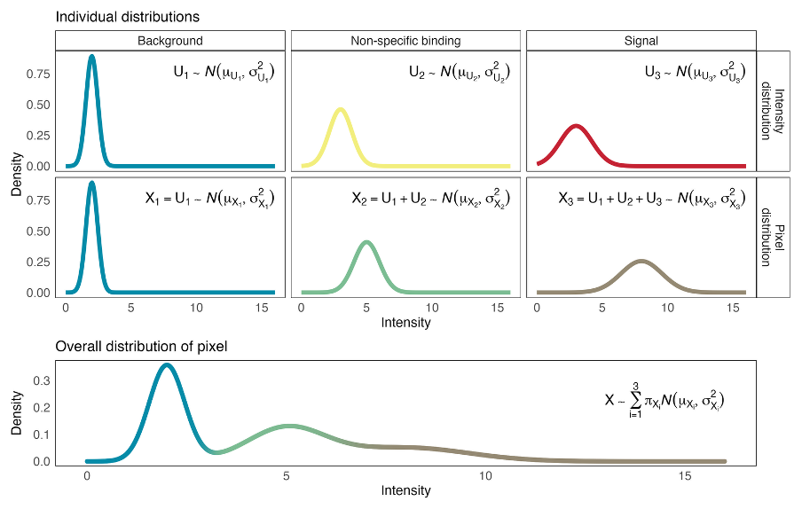

```{r setup, include=FALSE}
knitr::opts_chunk$set(
    collapse = TRUE,
    comment  = "#>",
    fig.width  = 7,
    fig.height = 4,
    message  = FALSE,
    warning  = FALSE
)
```

# Introduction

**bgnorm** (Kharbanda, Tubelleza *et al.* 2025) is a generative statistical
framework for background correction, normalisation, and quality control of
multiplex spatial proteomics data, including data from the Akoya
PhenoCycler-Fusion (formerly CODEX), Cell DIVE, IMC, and CosMx platforms.

The framework models log~2~-transformed fluorescence intensities as a
**three-component Gaussian Mixture Model** (GMM):

| Component | Biological interpretation                     |
|-----------|-----------------------------------------------|
| 1         | Background (empty space, instrument noise)    |
| 2         | Non-specific binding / autofluorescence       |
| 3         | True biological signal                        |

```{r signal_model, echo=FALSE, out.width="70%", fig.align="center", fig.cap="Three-component signal model: each pixel intensity X is the sum of independent latent sources U1 (background), U2 (non-specific), and U3 (signal)."}

```

A closed-form **deconvolution** step isolates the signal component from
background sources.  An optional **quantile normalisation** step (bgnormQ)
unifies the dynamic range across markers, samples, and 3-D tissue slices,
enabling a single fixed positivity threshold across the dataset.

The **Jensen-Shannon Divergence (JSD)** between components 2 and 3 provides an
automated quality control metric: higher JSD indicates better staining quality.

## Installation

```{r install, eval=FALSE}
if (!requireNamespace("BiocManager", quietly = TRUE))
    install.packages("BiocManager")
BiocManager::install("bgnormR")
```

```{r library}
library(bgnormR)
```

---

# Example dataset

The package includes a cropped head-and-neck cancer (HNC) tissue section
imaged on an Akoya PhenoCycler-Fusion platform.  The file ships at
`inst/extdata/PA_HNC_sample.qptiff` and contains five markers across a
550 × 800 pixel region.

```{r load_sample}
path <- system.file("extdata", "PA_HNC_sample.qptiff", package = "bgnormR")
img  <- read_qptiff(path)
img
```

`read_qptiff()` parses the channel names from the embedded metadata, so
`names(img)` returns the protein names directly:

```{r channel_names}
names(img)   # five-plex panel
dim(img)     # height × width × channels
```

---

# Pixel-level normalisation

## Raw intensity maps

Before normalisation, visualise the raw 16-bit intensities to confirm the
image loaded correctly.  `plot_qptiff()` renders one panel per requested
channel.

```{r plot_raw, fig.height=3}
plot_qptiff(img, markers = c("PanCK", "Vimentin", "CD20"))
```

## Running bgnorm_pixels

`bgnorm_pixels()` fits a three-component GMM to each channel independently.
`sample_prop` controls the fraction of non-zero pixels used for fitting —
the default 0.1 (10 %) is sufficient for full-resolution Akoya images while
keeping runtime short.

```{r bgnorm_pixels}
res <- bgnorm_pixels(img, sample_prop = 0.1)
res
```

`res` is a `QPTIFFImage` whose pixel values are the background-adjusted
log~2~-intensities.  Per-channel model parameters are stored as an attribute
and retrieved with `bgnorm_results()`:

```{r bgnorm_result}
br_panck <- bgnorm_results(res)[["PanCK"]]
print(br_panck)
```

`summary()` shows the full component table:

```{r bgnorm_summary}
summary(br_panck)
```

## Intensity distributions with GMM overlay

`plot_distributions()` draws the raw log~2~-intensity histogram alongside the
fitted GMM component densities.

```{r plot_dist, fig.height=5}
plot_distributions(res)
```

The three overlaid curves correspond to the background (blue), non-specific
(orange), and signal (red) components.  Markers with well-separated signal
components (PanCK, Vimentin) show a clearly distinct red peak at high
intensity.

## Background class assignment

`plot_pixel_classes()` colours each pixel by its MAP component assignment
(background / non-specific / signal).

```{r plot_classes, fig.height=4}
plot_pixel_classes(res, markers = c("PanCK", "CD20"))
```

## Adjusted intensity maps

After normalisation, visualise the background-adjusted images.  The adjusted
values are stored inside `res` (the returned `QPTIFFImage`), so
`plot_qptiff(res)` displays them directly — applying the `2^x` back-transform
so the display is in linear intensity units.

```{r plot_adj, fig.height=3}
plot_qptiff(res, markers = c("PanCK", "Vimentin", "CD20"), scale = "marker")
```

## Quantile normalisation (bgnormQ)

Setting `quantile_norm = TRUE` rescales adjusted intensities so that the
75th percentile of the fitted signal component equals 1 across all markers.
This enables a single positivity threshold to be applied consistently across
markers, samples, and tissue sections.

```{r bgnormQ}
res_q <- bgnorm_pixels(img, sample_prop = 0.1, quantile_norm = TRUE)
```

---

# Quality control

## JSD summary table

`qc_summary()` computes the JSD between the non-specific and signal
components for every marker in a single call.

```{r qc_summary}
qc_df <- qc_summary(res)
qc_df
```

JSD values below 0.1 indicate likely failed staining; values between 0.1 and
0.2 warrant manual inspection (Kharbanda *et al.* 2025).

## JSD heatmap

`plot_jsd_heatmap()` summarises the JSD per marker as a heatmap, with circles
indicating data quality (white ≥ 0.2, orange 0.1–0.2, red < 0.1).  Pass a
named list of `QPTIFFImage`s to compare multiple samples side-by-side.

```{r plot_jsd, fig.height=2.5}
plot_jsd_heatmap(res)
```

---

# Exporting normalised images

`write_qptiff()` saves a `QPTIFFImage` as a multi-page 16-bit TIFF, one page
per channel.  For bgnorm-adjusted images the pixel values are back-transformed
to a linear scale (`2^x`) before writing.  Channel names and bgnorm model
parameters are embedded in each page's `ImageDescription` tag so the file
remains self-documenting.

```{r write_qptiff}
out <- file.path(tempdir(), "PA_HNC_bgnorm.tif")
write_qptiff(res, out)

# Read back – channel names are preserved
img_out <- read_qptiff(out)
names(img_out)
dim(img_out)
```

---

# Cell-level normalisation

When only per-cell intensity summaries (mean or median intensity per cell) are
available, use `bgnorm_cells()`, which applies a two-component GMM
(non-specific / signal) rather than the full three-component pixel model.

## Single-marker: bgnorm_cells

```{r cell_single}
set.seed(3)
cell_intensities <- inv_log_transform(
    c(rnorm(300, mean = 3, sd = 0.5),
      rnorm(100, mean = 7, sd = 0.9)),
    cofactor = 150
)
res_cell <- bgnorm_cells(cell_intensities)
print(res_cell)
```

## Integration with SummarizedExperiment

`bgnorm_sce()` processes a `SummarizedExperiment` (or any subclass such as
`SingleCellExperiment` or `SpatialExperiment`): it reads the requested assay,
runs `bgnorm_cells()` independently for each marker, and stores the adjusted
intensities in a new assay alongside per-marker `BgnormResult` objects in
`metadata()`.

```{r sce, message=FALSE}
library(SummarizedExperiment)
set.seed(5)

n_cells   <- 200L
n_markers <- 5L
marker_names <- c("CD20", "CD3e", "CD8", "PanCK", "Vimentin")

make_cell_raw <- function(j) {
    inv_log_transform(
        c(rnorm(round(n_cells * 0.7), 3, 0.5 + 0.1 * j),
          rnorm(round(n_cells * 0.3), 7, 0.8 + 0.1 * j)),
        cofactor = 150
    )
}
raw_mat <- do.call(rbind, lapply(seq_len(n_markers), make_cell_raw))
rownames(raw_mat) <- marker_names
colnames(raw_mat) <- paste0("cell", seq_len(n_cells))

se <- SummarizedExperiment(assays = list(counts = raw_mat))
se <- bgnorm_sce(se, assay.type = "counts", name = "bgnorm")
assayNames(se)
```

Per-marker model parameters are accessible via `metadata()`:

```{r sce_meta}
bgnorm_meta <- S4Vectors::metadata(se)$bgnorm_results
cat("JSD for CD20:", round(bgnorm_meta$CD20$jsd, 3), "\n")
```

## Distributions and QC for cell-level data

`plot_distributions()` and `plot_jsd_heatmap()` both accept a
`SummarizedExperiment` with bgnorm results stored in `metadata()`.

```{r dist_cell, fig.height=3}
plot_distributions(se)
```

```{r jsd_cell, fig.height=2.5}
plot_jsd_heatmap(se)
```

```{r qc_cell}
qc_summary(bgnorm_meta)
```

---

# Mathematical background

## Log~2~ transform

$$I_{\log} = \log_2\!\left(\frac{I}{c} + 1\right), \quad c = 150$$

## Three-component GMM

$$f(X_i) = \sum_{j=1}^{3} \pi_j \, \mathcal{N}(X_i \mid \mu_j, \sigma_j^2)$$

Components are ordered so that $\mu_1 < \mu_2 < \mu_3$ (background,
non-specific, signal).

## Background deconvolution

$$X_{\text{adj}}(x) = P(C\!=\!3 \mid x) \left[
  (\mu_3 - \mu_2) +
  \frac{\sigma_3^2 + \sigma_2^2 - 2\min(\sigma_2^2, \sigma_3^2)}{\sigma_3^2}
  (x - \mu_3)
\right]$$

## Quantile normalisation factor

$$q_{\text{norm}} = P(C\!=\!3 \mid q_{0.75}) \left[
  (\mu_3 - \mu_2) +
  \frac{\sigma_3^2 + \sigma_2^2 - 2\min(\sigma_2^2,\sigma_3^2)}{\sigma_3^2}
  (q_{0.75} - \mu_3)
\right]$$

## Jensen-Shannon Divergence

$$\text{JSD}(P \| Q) = \frac{1}{2} D_{\text{KL}}(P \| M) +
                        \frac{1}{2} D_{\text{KL}}(Q \| M), \quad
M = \frac{P + Q}{2}$$

---

# Session information

```{r session}
sessionInfo()
```
